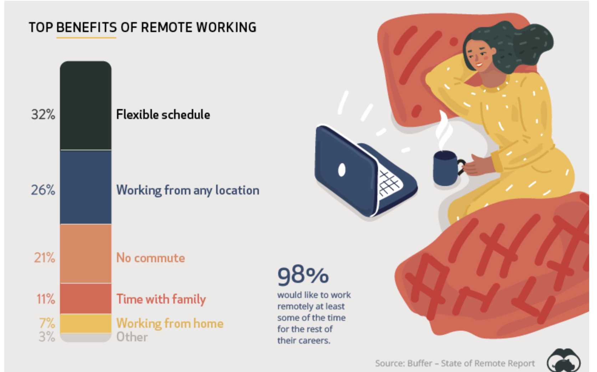
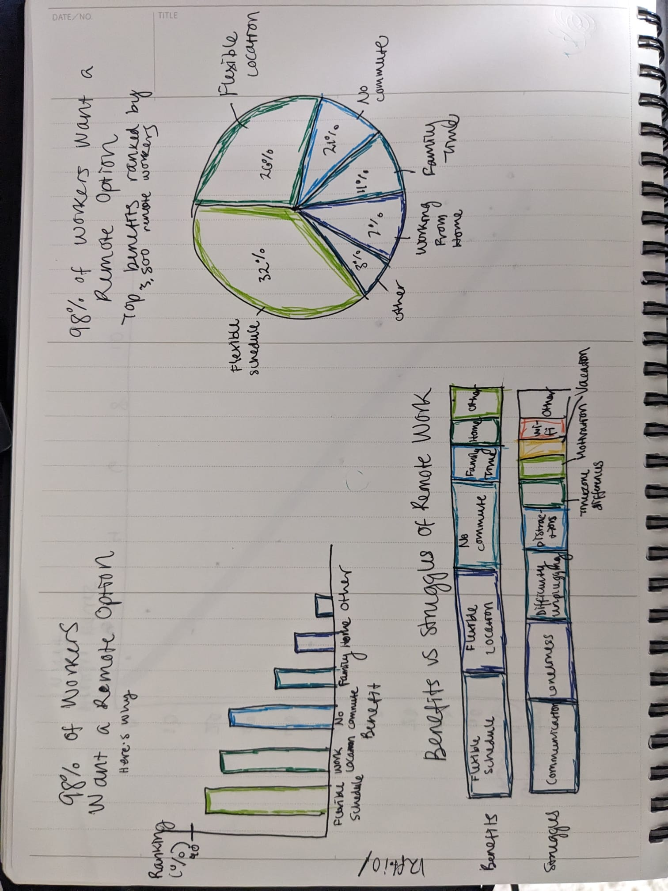

| [home page](https://cmustudent.github.io/tswd-portfolio-templates/) | [data viz examples](dataviz-examples) | [critique by design](critique-by-design) | [final project I](final-project-part-one) | [final project II](final-project-part-two) | [final project III](final-project-part-three) |

# Critique By Design: Benefits of Remote Work

## Step one: the visualization

Original Data Viz from [Visual Capitalist](https://www.visualcapitalist.com/how-people-and-companies-feel-about-working-remotely/), data set from Buffer: ["State of Remote Work 2020"](https://buffer.com/state-of-remote-work/2020)

I chose this data visualization because I actually kind of liked it. I'm drawn to the color palette and the illustration was cute. But the more I looked at it, the more I was confused by what exactly it was trying to represent and who the target audience was. Were the variables in the stacked bar ranked by each employee highest to lowest? Was the original survey pre-populated with these options or were the unanimously chosen? It was a simple enough concept to convey, but I thought I could make it even more apparent and simple.

## Step two: the critique
I found Stephen Few's Data Visualization Effectiveness Profile to be fairly comprehensive. It immediately drew me to the areas that I wanted to focus on my redesign, which were engagement and intuitiveness. While the original visualization was pretty, my engagement didn't go far beyond that. I wanted this to be a straightfoward piece of information that audiences could take away and share with others. Particularly, I thought the key audience for this visualization should be employers or managers. They certainly don't want to see a picture of a lazy worker curled up in bed if they need to be convinced on the benefits of remote work. Even if their company is not set up for remote work, what are the aspects of it that they could incorporate into their work culture? None of these answers are readily available in the original design. 

I also questioned the choice of a stacked bar chart for the chart type. It's easy enough to see which categories have higher percentages, but I didn't think it was as important to show this data as a part of a whole. I got stuck on this (which you'll see in my sketches) but my final redesign solved this issue. 

The big number to the right is a compelling factoid: 98% of workers want this thing! I didn't want to dismiss taht completely, but questioned the placement and purpose of it in the overall story. 

## Step three: Sketch a solution

Here are three options I came up with during the sketching phase. I tried out a simple column chart, a pie chart, and a bullet chart. For the bullet chart, I pulled in another data set from Buffer because I thought it might be interesting to compare benefits and struggles, but ultimately found it not super useful or compelling. The pie chart is a go-to for parts of a whole visualization and the column chart is straightfoward and classic! Admittedly, not a whole lot of thought went into the color choice for these. I only have so many colored pens at home and wanted to make it pretty without distracting too much, but I probably could have left it out for the sketches. This is also where I decided to incorporate the 98% statistic into the title. I think it's attention-grabbing and makes you want to know more.

## Step four: Test the solution

Results: 

| Question | Interview 1 (MISM Student) | Interview 2 (PPM Student) | Interview 3 (MISM Student) | 
|----------|-------------|-------------|
| Does this make sense?         |  Yes, easy to understand           |  Pretty straightforward           |  Yeah               |
| Describe what this is telling you         | Ranking the information by # of people who cited as a favorable quality            |   A lot of workers want flexibility          |      Why people want to do remote work         |
| Is anything confusing?         |  Ranking percentage - more context           |  No           | Different shades of green and blue, do they signify anything?          |
| Who do you think is the intended audience? |  Managmenet/employees trying to persuage managers            |   Employers               |   Employers           |
| What would you do differently?  |   Flexible location, schedule, work from home are the same and can be grouped               |   Make categories of variables by color             |  Different color palette                |
| Which of the 3 do you like the best? | Pie chart | Pie chart | Pie chart |

Synthesis: 

Main takeaways:
The information presented is straightforward, but more of a story could be told here.
Be careful about use of color and what it signifies or doesn't signify. 
Are there groups of variables that make sense to categorize together?
Focus in on the pie chart as the chart type, it makes the most sense with the data set.
Don't compare benefits vs struggles, focus on the positive. Telling a pro-work from home story.
Most frequently cited benefits instead of ranked benefits could get you out of the pie chart if necessary.

How I'll implement them:
I will group the variables in categories that make sense such as "location" and "flexibility" so that it's immediately clear the overarching themes of what people want from working remotely.
I will make a simpler color palette that associates the different variables with the larger categories they fit into.
I will consider sticking with the pie chart and make it as clear as possible. 

## Step five: build the solution

<noscript></noscript><object class='tableauViz'  style='display:none;'><param name='host_url' value='https%3A%2F%2Fpublic.tableau.com%2F' /> <param name='embed_code_version' value='3' /> <param name='site_root' value='' /><param name='name' value='BenefitsofRemoteWork_17394113277670&#47;ColumnChart' /><param name='tabs' value='no' /><param name='toolbar' value='yes' /><param name='static_image' value='https:&#47;&#47;public.tableau.com&#47;static&#47;images&#47;Be&#47;BenefitsofRemoteWork_17394113277670&#47;ColumnChart&#47;1.png' /> <param name='animate_transition' value='yes' /><param name='display_static_image' value='yes' /><param name='display_spinner' value='yes' /><param name='display_overlay' value='yes' /><param name='display_count' value='yes' /><param name='language' value='en-US' /><param name='filter' value='publish=yes' /></object>
                

Surprise! I went with my original idea - the column chart. In my interview process, my classmates unanimously chose the pie chart as their favorite of my 3 sketched ideas. However, I felt off about this given that I wanted to move away from the parts-of-a-whole visualization and pie charts are generally overused and underwhelming. I decided to watch the Makeover Monday tutorial on this data visualization, and the designer had the same process as I did. He started with a column chart, liked it the best, tried some others, and ended up sticking with the column chart. One resource he walked through was using Tableau's Visual Vocabulary which is another version of the chart glossary in Good Charts. It's very intuitive to follow and you can find chart types based off their functionality. He wrote down a few that he thought might work and tried each, then crossed them off if they weren't effective. I like this method of choosing chart types and thing it will be very useful for my final project. 

It was really helpful for me to follow along with his tutorial given my greenness with Tableau. He had the idea to highlight the top 80% of the data, but I realized the top 2 variables both had the theme of flexibility, so I decided to zero in on that with the simple color scheme and the subtitle. He suggested simplifying the variable names by giving them aliases and I liked this. Not too much text and straight to the point. 

I ended up deciding to not even include the percentage numbers on the columns themselves. The direction I went with the title and subtitle is meant to draw in an employer or manager who's looking to solve the ever-present issue of remote work or requiring work days in office. The clear message is that flexibility is highly valued. Exactly which percentage of each variable was ranked the highest in the sruvey is not quite as important. Plus, the y-axis percentage numbers are there if you're really curious. 

This process was really helpful. Picking a simple data visualization that I actually liked was a bit of a challenge, but the critique process helped me understand where it was falling short. Despite not using a pie chart, the rest of my classmates' advice came through in the final design. Simplify the colors and make them mean something. Categorize the variables to tell a story. Then, going through the Makeover Monday tutorial really tied it all together as the designer's choice aligned with my process up to that point. 

## References
Andy Kriebel's [Watch Me Viz](https://www.youtube.com/watch?v=Pf-ADZqo6MM&list=PLX-uPHRG0cLb697Ie-ZGSObRLLNhxzJGK&index=146) redesign tutorial
Visual Capitalist ["How People and Companies Feel About Working Remotely"](https://www.visualcapitalist.com/how-people-and-companies-feel-about-working-remotely/), 2020
Buffer ["State of Remote Work 2020"](https://buffer.com/state-of-remote-work/2020)
Tableau [Visual Vocabulary](https://www.tableau.com/solutions/gallery/visual-vocabulary)
Berinato, Scott. 2016. Good Charts: The HBR Guide to Making Smarter, More Persuasive Data Visualizations. Boston, Massachusetts: Harvard Business Review Press.

